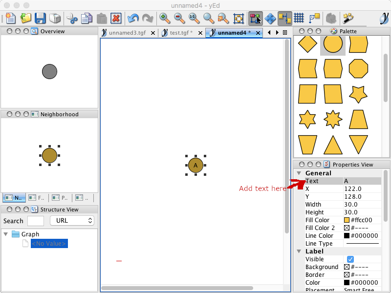
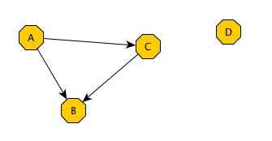

# CS230X-lab8-F24
# Introduction to DiGraphs and yEd

## Learning Goals
* review and use java's LinkedList classes
* get familiar with the yEd graph drawing application
* practice graph layout
* start the DiGraph (Directed graph) interface implementation

## Task 1: Working with **yEd** 

<em>yEd</em> is a tool for creating, importing, and sharing graphs.

* Download [yEd](http://www.yworks.com/en/products_yed_about.html)
   to your computer in lab, and on your own computer.
   
* The starter code for this lab contains:
1. the **DiGraph** interface
2. a starting version of the **AdjListsDiGraph** class
3. a folder **tgf_graphs** with some sample graphs

Today, we will start writing an **AdjListsDiGraph** class, as an implementation
of the **DiGraph** (Directed Graph) Interface.
We'll use <em>yEd</em> to create graphs and then save these graphs as **.tgf** files (tgf stands for *trivial graph format*).
The **AdjListsDiGraph** class will interact with **.tgf** files.

* A **.tgf** file is a text file containing the list of vertices, one per line, followed by the # symbol in a single line, followed by a list of arcs, one per line.
What do you think the TGF file for the graph above looks like? How about this?
<pre>
1 brian
2 sohie
3 stella
4 takis
#
1 2
2 1
3 4
4 3
1 3

</pre>
Actually, there is one more arc that is included in the TGF file. Can you guess which one?

### Task 1A: Creating a graph in **yEd**

We have created a <a href="https://www.youtube.com/watch?v=XnfCejfexMM">video</a> to show you how to use **yEd**, feel free to look at it as you read the instructions below.

**Note** yEd is getting updated often and its icon and the interface look different now than when we took the snapshots. Its basic functionality remains the same, however. So, it the picture below does not look exactly like what is on your screen, it's OK. 

Follow these steps to get a feel for how **yEd** works.
* Start yEd. Click on the **Create a New Document** icon.
* If there is no palette with shapes on the window, click on the canvas and you will see a node appearing. (If there is a palette, drag a node from the **Shape Nodes** palette to the main window.)
* If you make a mistake, undo (command-z) and try again.
* Now let's give a name to our node:
* Double-click on the node and type "A" (directly on it or in the Text field of the Properties View):

* Repeat three more times, so you have four total nodes, labelling them B,C,D
* Add an edge between two nodes by clicking inside a node and dragging your mouse until it is inside the other node. For example:

* Save your graph as a **TGF** file. 
yEd allows you to save your graphs as .tgf (trivial graph format) files.
To do this:<strong> File > Save As > TGF Format (*.tgf)</strong> from  the drop down
menu (see image below).

### Task 1B: Opening a file in **yEd**

In the folder you downloaded there is a subdirectory **tgf_graphs**.
In there, you can see several files that you can open in **yEd**
If you have installed **yEd** correctly, you should be able to double-click and open them.

When you open a TGF file, it seems that there is only one vertex. That's because yEd does not know how to lay out the vertices of the graph and has them all placed on top of each other, as if on a stack! 
* You can **click-and-drag** one vertex at a time and pull them to a different location on the yEd panel, revealing the other vertices below. Doing so you can create your own layout to have the graph look the way you like it.
* Or you can try the `Smart Organic Layout` which is often the default choice. Click on the blue triangle to animate showing the layout.
* Have fun looking at other graphs if you have time and interest.

## Task 2: Write the `AdjListsDiGraph` class
Your **AdjListsDiGraph** class will be able to 
* construct an empty graph, 
* add and remove vertices and 
* add and remove arcs to/from it. 

Start by drawing a simple graph, like the one below, and filling in the Data Structures that represent it.

 
 
**Task 2A: Study the Starter code**
Notice:
1. the **instance variables**:
 * an ArrayList of generics, named **vertices** to hold the vertices of the graph,  and
 * an ArrayList of LinkedLists of generics, named **arcs**. In the Adjacent Lists Directed Graph implementation, each such list corresponds to a vertex, and holds the adjacent vertices to that vertex.

2. the **constructor** with no inputs, which create an empty graph.
3. the static **`AdjListsGraphFromFile()`** method, which takes as an input the name of
a file, in tgf format, and returns an instance of an **AdjListsDiGraph<String>**.
4. the **`saveToTGF()`** method, which writes the **AdjListsDiGraph** instance into the files whose name is passed an an input parameter to the method.

* As always, you should test your code incrementally, i.e every method as you write it, before you move on to the next one. For testing purposes, you can use the **`saveToTGF()`** which is already defined for you. 
* We also defined for you the **`toString()`** which offers this String representation:
<pre>
Vertices:
[A, B, C, D]
Arcs:
from A: [B, C]
from B: []
from C: [B]
from D: []
</pre>

We have found the above **String representation** to be quite convenient. Of course, it is up to you to decide on a reasonable String representation for a graph.

**Task 3B: Add the following method definitions (and test)**
Continue writing code in the **AdjListsDiGraph.java** file, according to this order:
1. **`public boolean isEmpty()`**: It returns true iff the graph is empty

2. **`public int getNumVertices()`**: It returns the number of vertices in a graph

3. **`public int getNumArcs()`**: It returns the number of arcs in a graph

4. **`public void addVertex (T vertex)`**: Adds the input vertex to the graph. If the vertex exists in the graph already, the graph should not be changed.

5. **`public void addArc (T source, T destination)`**: Adds an arc to the graph, from source to destination. If the source or the destination does not exist in the graph, the graph should not change. If the arc to be added is already in the graph, it should not be added again.

## SAVING YOUR WORK ON GITHUB
As we have discussed in class, it is important to work on labs and assignments regularly and save frequently. You should test your work incrementally, which will require you to save your file before compiling/running it. In addition to saving your work on your local machine, you should also frequently push your work to this Github repository. You can refer to Lab0 and the [Git and Github tutorial](https://github.com/CS230X-F24/github-starter-course) for a refresher on using these tools. 

## SUBMITTING TO GRADESCOPE
Turn in your work submitting files AdjListsDiGraph.java to your Gradescope account for Lab8. You will receive full credit for this lab if you submit a reasonable attempt at completing the lab by the deadline. [Click here for Gradescope instructions.](https://docs.google.com/document/d/1zGAJrbdAhfPZVlyDP9N3MmdKXWvNo7rQqehKNM5Q0_M/edit) 

## AUTOGRADER
When you submit your lab to Gradecope, you will immediately see some feedback through the autograder. You are welcome to resubmit as many times as you wish until the deadline. The autograder will check for accuracy, style, and documentation. Make sure there are no remaining `TODO` comments in your submission code. Click here for 230X instructions on: [testing your code](https://docs.google.com/document/d/19cKOyolT8UtSfMNrVw8MGgVWS-lYgHpBs8g2Cf_8Vvc/edit#heading=h.rt39ohf1jp6s), [styling your code](https://docs.google.com/document/d/14uwj9HAjNKfFBm0ZjUpWR7jdqKSj13rudIEJaG74mPk/edit), and [documenting your code](https://docs.google.com/document/d/15uqs_NH8y2sAuLLpiZuSxlI0UsL6a8CHuWY_qcvF4B4/edit). 

## LAB SOLUTIONS
Lab solutions will be added to this repository after the lab deadline. 
